# Musical Taste Analysis
*Brady Kremer*, *Cullen McNamee* & *Manoradhan Murugesan*

## Executive Summary

* The purpose of this project is to infer insights on artists/ music trends from Echo Nest’s Million Songs Dataset, enrich it with listening/ likes history from online music social networks such as lastfm, and visualize musical tastes evolution of users over a 10 year period.
* The business use case is to better understand types of music listeners with the goal of laying the groundwork for being able to recommend songs that fit their tastes.

## Research Objectives

* Download and transform data from Echo Nest project and lastfm API.
* Create a data warehouse to store the large datasets with desired aggregated metrics.
* Leverage analytical methods to understand listener taste 
* Provide reporting based on gleaned insights

## Dataset Introduction

### Million Songs Dataset (MSD)
* Audio features & metadata for 1 million songs provided by Amazon Echo Nest
* Represents songs from nearly 45k artists
* 273 GB

### Last.fm API Calls
* Over 940k songs,
* Unstructured dataset - pulled via API calls in XML format
* Largest information source of user listening history

## Data Management Architecture

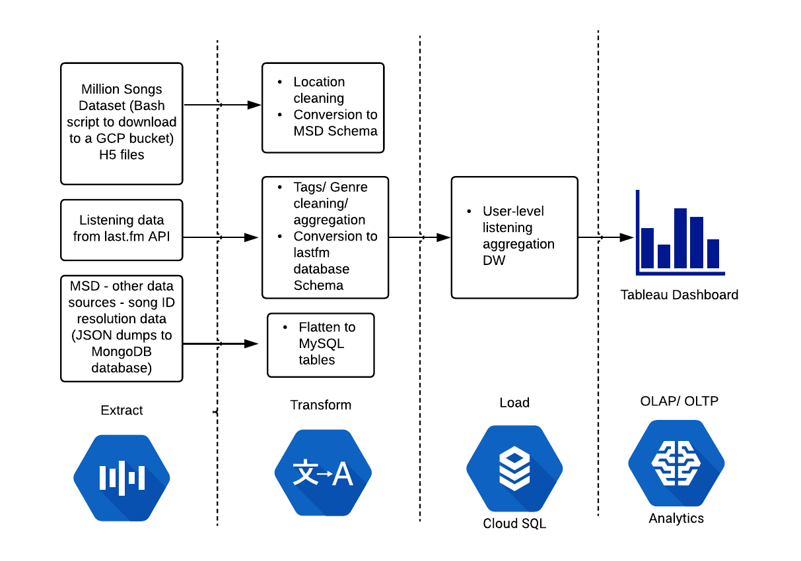

## Sourcing/ Transforming the data

### MSD
* Compiled by Echo Nest.
* Automated the download & decompression of 26 archive files to hdf5 files. 
* Python script populates database with date from these files

### last.fm Dataset
* Scrobbling is the act of sending the name of a song to a website when a user listens to it, adding it to their profile. 
* Used API functions to return scrobble, genre, and track data
* Used this data to populate a new database

### Challenges
* Both datasets are very large and mandated steps such as automation/ state preservation to import into the database


## Data Staging with NoSQL
* Discovered a data set from a now defunct Echo Nest project that matches track id to other online music social network sites such as spotify
* Uploaded JSON track info to a MongoDB database and flattened the collection to two MySQL tables using Python.
* Purpose of this exercise is to match the Million Song Dataset with other music portals and use them to enrich the current data


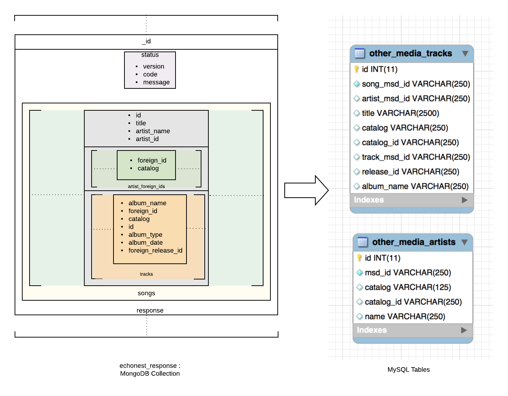

# Data Transformation
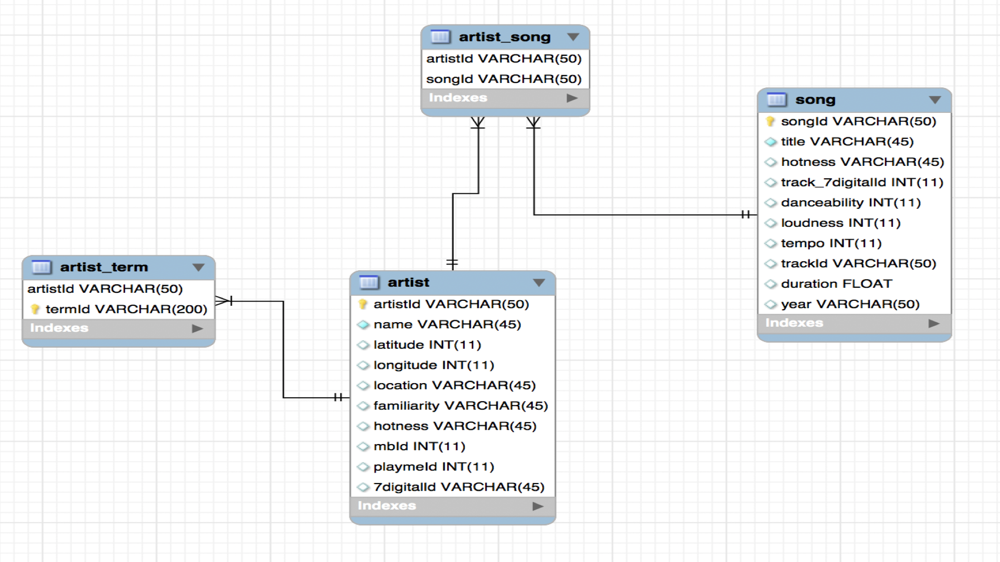

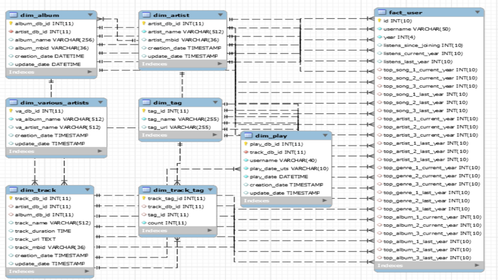

## Business Insights - Geo Analysis of Artists
* The top figure to the left shows musical artists in the Million Song Dataset mapped by geographical location of their birthplace.
* The bottom figure filters this same group to instead only show those artists that scored well above average in Familiarity and Popularity/Hotness.
* We can see from this that the US is the most densely populated in both -- in particular on the coasts and in Southern States.
* More interestingly, we can see that Britain maintains a high concentration of artists, even when filtering popular artists. This is noteworthy given Britain’s smaller population relative to some of the other regions.
* Finally, we see that artists from the Middle East, Africa, and South America mostly fall off the map once applying the popularity filter.
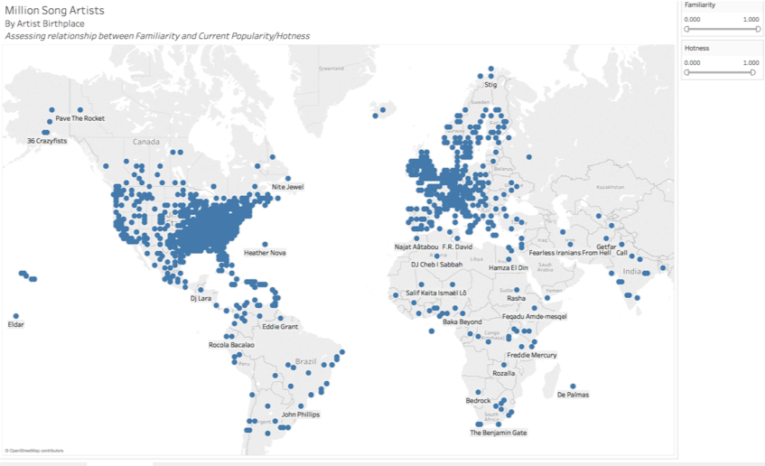
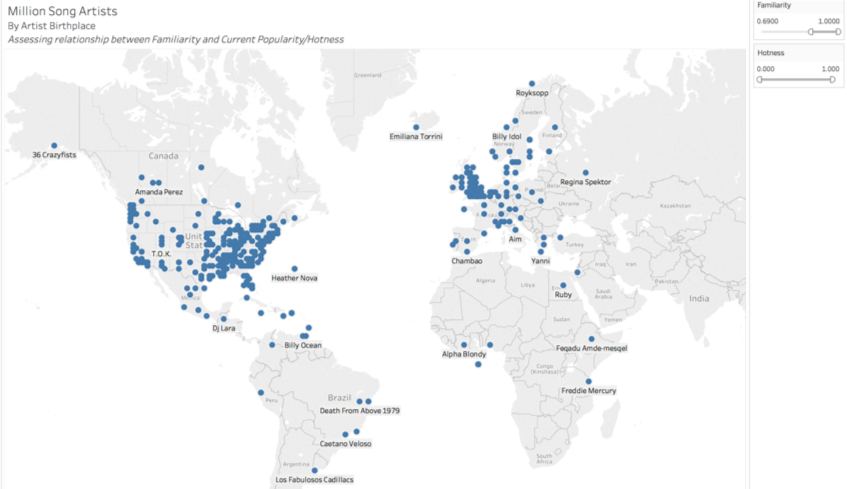

## Business Insights - Geo Analysis of Artists
* Another interesting artifact we can analyze with this dashboard is it compare artists that scored well in Familiarity but not Hotness and vice versa.
* We can see from the top figure that jazz artists such as Wynton Kelly and the Dirty Dozen Brass Band do not have mainstream appeal measured by Familiarity, however they have high Hotness scores due to an avid/concentrated following.
* On the other hand, a Britney Spears duet with Don Phillip scored high in terms of Familiarity but very low in Hotness. This result is intuitive as Britney Spears is one of the most recognizable artists worldwide -- however, few listeners are interested in her lone track with writer Don Phillip (I Will Still Love You)
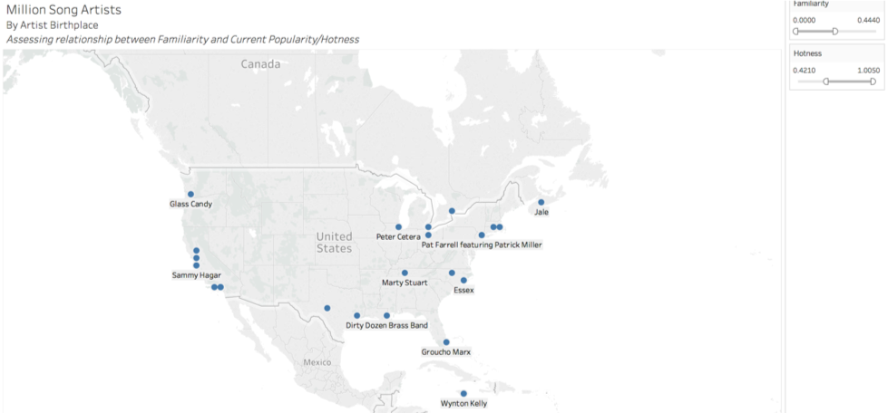
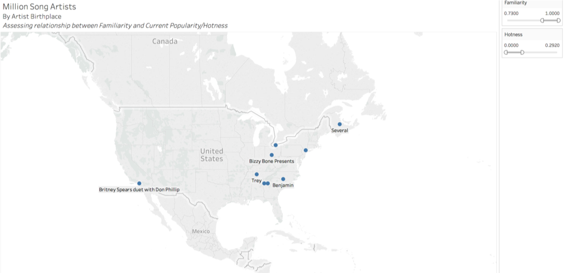

## Business Insights - User Listening Trends
* The figure above allows us to analyze the most popular tags or genres associated with songs listened to by a single user - in this case user “HDiggityFlan”.
* For this user, the most popular tags were “alternative”, “beautiful”, “indie”, “pop”, and rock. 
* In general, the users listening count to each of these was pretty evenly distributed. The user saw a dip in total listens to the 5 genres from 2013 to 2015 of approximately 300 -- however, this quickly jumped in 2016 with each genre received about 300 listens a piece.
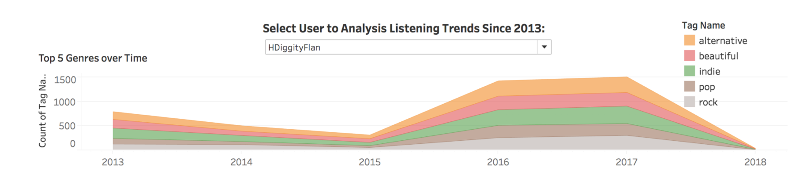

## Business Insights - User Listening Trends
* The stacked bar graphs above show trends in the user’s concentration of listening based on Artist and Album.
* For example, from 2016 to 2017 the user listened to roughly the same number of songs. However, we can see that a single album comprised a oversized portion of listens in 2015 and 2016 but was greatly reduced by 2017.
* Using the interactive Tableau dashboard, we can see that this Album was “Divers” by Joanna Newsom. Play count went from 216 in 2015 to 249 to 2016, before dropping to 99 in 2017.
* Further behavioral analysis of this sort would allow us to classify the expected duration of heavy listening for a user based on categories such as tags and genre.
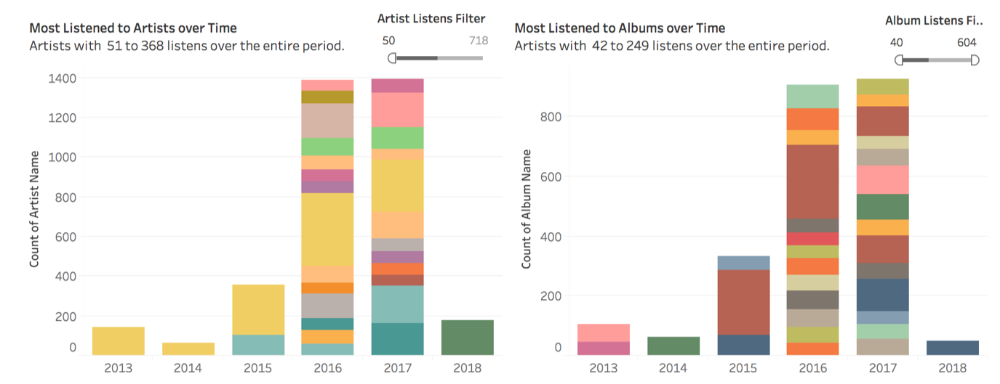

## Business Insights - User Listening Trends
* Finally, sourced by our fact table, we can see the user’s most listened to song, artist, album, and tag respectively for each year.
* As expected based on the prior slide, Divers was the user’s most listened to album in 2015 and 2016. While the Root’s Undun unseated Divers in 2017, Joanna Newsom held her top spot as the most listened to artist.
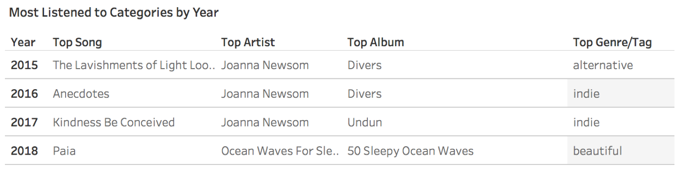


```python

```
